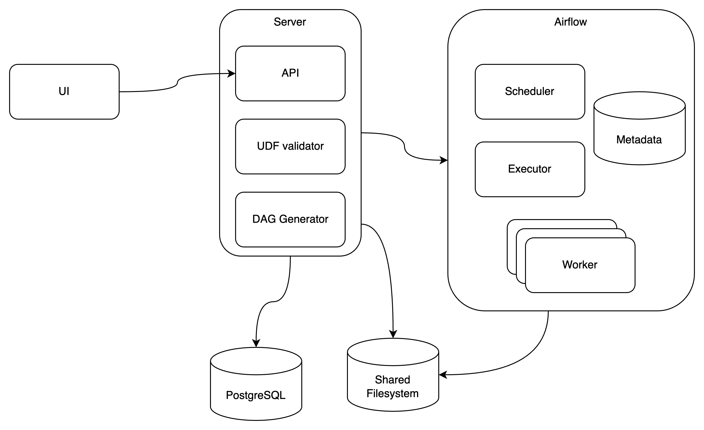

# Workflow 시스템 아키텍처 설계 문서

## 1. 개요

본 문서는 Workflow 시스템의 전체 아키텍처를 정의한다.

## 2. 시스템 개요

### 2.1. 주요 목표

- 사용자가 직접 Task(UDF) 를 정의 할 수 있음
- Airflow DAG 기반 Workflow 생성 및 실행 가능
- Task 단위 실행 및 모니터링 기능 제공

### 2.2. 주요 구성 요소

| 컴포넌트                                | 설명                                    |
|-------------------------------------|---------------------------------------|
| Frontend (Vue 3)                    | DAG 편집 및 workflow 관리 UI               |
| Backend (Python - FastAPI)          | python 을 이용해 task, DAG API 및 UI 서버 개발 |
| DAG Execution & Scheduler (Airflow) | Airflow 의 DAG 를 정의해서 task 실행 및 관리     |
| Storage (PostgreSQL, Filesystem)    | task, DAG 의 메타데이터 저장 및 파일 저장          |

## 3. 아키텍처 개요

### 3.1. 전체 아키텍처 다이어그램

### 3.2. 컴포넌트 상세 설명

#### 3.2.1. Frontend

- DAG 를 Drag & Drop 으로 구성
- UDF 목록 조회, 추가, 삭제 등 기능
- 실행 상태 및 로그 조회 기능
- DAG 시각화

#### 3.2.2. Backend

- Workflow 관리 API 제공
- DAG 실행 요청을 Airflow 에 전달
- PostgreSQL 에 DAG, Task 메타데이터 저장

## 4. 데이터 흐름

### 4.1. UDF 등록 및 조회 흐름

1. 사용자가 python 파일로 UDF 함수를 생성
2. UI 를 통해 python 파일 업로드
3. 서버에서 python 파일 정의 확인 후 저장
4. UI 를 통해 등록된 UDF 확인

### 4.2. DAG 생성 및 실행 흐름

1. 사용자가 UI 에서 UDF 확인 및 Drag&Drop 을 통해 DAG 구성
2. DAG 의 초기 입력값 입력
3. UI 에서 실행 스케줄 설정
4. 서버에서 DAG 생성
5. Airflow 스케줄러가 확인 후 이용가능한 DAG 목록 UI 로 전달
6. 사용자가 UI 에서 실행 or 스케줄에 따라 실행
7. 실행 결과 ... 에 저장
8. 사용자가 UI 에서 실행 결과 조회 및 확인

## 5. 확장성 고려 사항

### 5.1. UDF Dependency

- 사용자가 정의한 UDF 에서 사용하는 디펜던시를 추가하고, Airflow 환경에서 독립 실행이 가능하도록 설계

### 5.2. 태스크간 데이터 통신

- 메시지 큐를 이용한 연동

### 5.3. 고가용성 및 장애 복구

- Docker/K8s 기반 배포
- 실패한 태스크의 감지 및 재실행 기능
- 결과 데이터 저장 및 각 태스크간 데이터 저장(중간 저장 기능)

## 6. 결론

Workflow 시스템은 사용자가 쉽게 DAG를 정의하고 활용 가능한 플랫폼을 목표로 개발